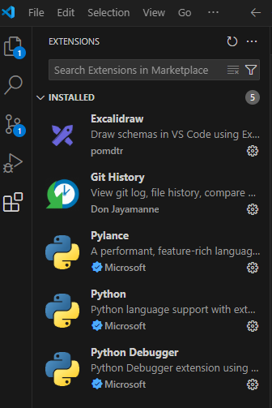
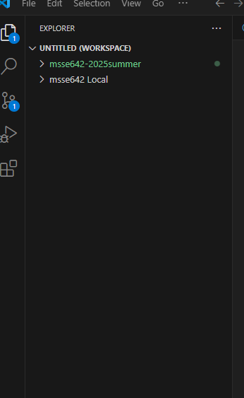

## ACTIVITY 1: Configure Visual Studio Code (VSC)

## ACTIVITY 2: Clone the class repo and add to your VSC Workspace

## Activity 3: Writing a Good README

A good README helps users and developers understand the purpose and usage of a software project. It typically includes the following sections:

### Key Elements of a Good README:
- **Title**: Clear and descriptive project name.
- **Description**: Overview of what the project is and what problem it solves.
- **Installation**: Instructions for setting up the project locally.
- **Usage**: Examples of how to run or use the application.
- **Features**: Highlights of what the project can do.
- **Technologies Used**: Tools, programming languages, and libraries.
- **Contributing**: How others can contribute to the project.
- **License**: The legal usage terms of the project.
- **Contact Info**: Who to reach for support or questions.

