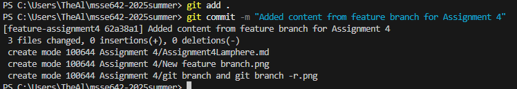

### Step 1: Created a feature branch in VS Code
*Used the Source Control menu in Visual Studio Code to create a new branch for this assignment.*

---

### Step 2: Ran `git branch` and `git branch -r`
*Compared local and remote branches using CLI.*

**Difference:**  
- `git branch` shows **local branches only**.  
- `git branch -r` shows **remote branches only**, such as those on GitHub.

---

### Step 3: Committed local changes
*Staged and committed updates to the feature branch using CLI.*

---

### Step 4: Published Feature Branch
*Pushed the new feature branch to the remote repo using Visual Studio Code.*

---

### Step 5: Created a pull request and deleted branch on GitHub
*Merged the feature branch into the main branch via a GitHub pull request and deleted the remote feature branch.*

---

### Step 6: Ran `git fetch -p` and checked local branches
*Updated local Git metadata and confirmed which branches still existed locally.*

**Q: Will the local feature branch still exist after the remote is deleted?**  
**A:** Yes, the local feature branch remains on your machine until you delete it manually.

