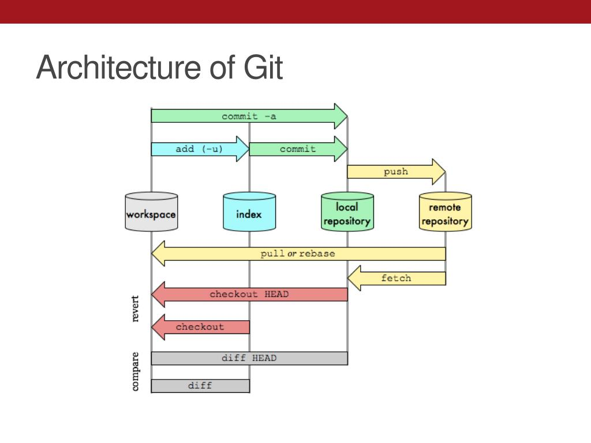

# msse642-2025summer

# Assignment 1

## Git Research Notes

### Types of Version Control Systems
- **Local Version Control Systems**: Store versions on the local machine.
- **Centralized Version Control Systems (CVCS)**: Single central server stores all versions.
- **Distributed Version Control Systems (DVCS)**: Each user has a full copy of the repository. A Git is a type of DVCS.

### Snapshots
Git stores data as snapshots of the entire project at a given point in time, rather than as a set of file differences.

### What is a Repository?
- A repository (repo) is a storage space for your project and its history.
- **Local repo**: The copy on your computer.
- **Remote repo**: The copy hosted on a server like GitHub.

### What is a Commit?
A Commit is a saved snapshot with a message describing the changes made.

### What is the Working Directory?
The working directory is the folder on your computer where you edit files.

### What is the Staging Area?
The staging area is a place where you prepare changes before committing them.

### Git Architecture Diagram

### Reference/Research
ChatGPT
https://www.slideserve.com/zandra/git-introduction
https://www.geeksforgeeks.org/centralized-vs-distributed-version-control-which-one-should-we-choose/

# Assignment 2
[Assignment #2](./Assignment%202/Assignment2Lamphere.md)

# Assignment 3

[Assignment #3](./Assignment%203/Assignment3Lamphere.md)
